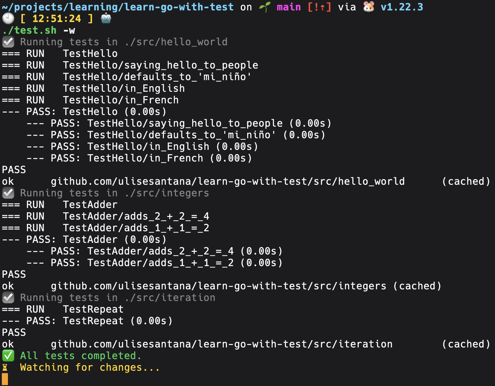
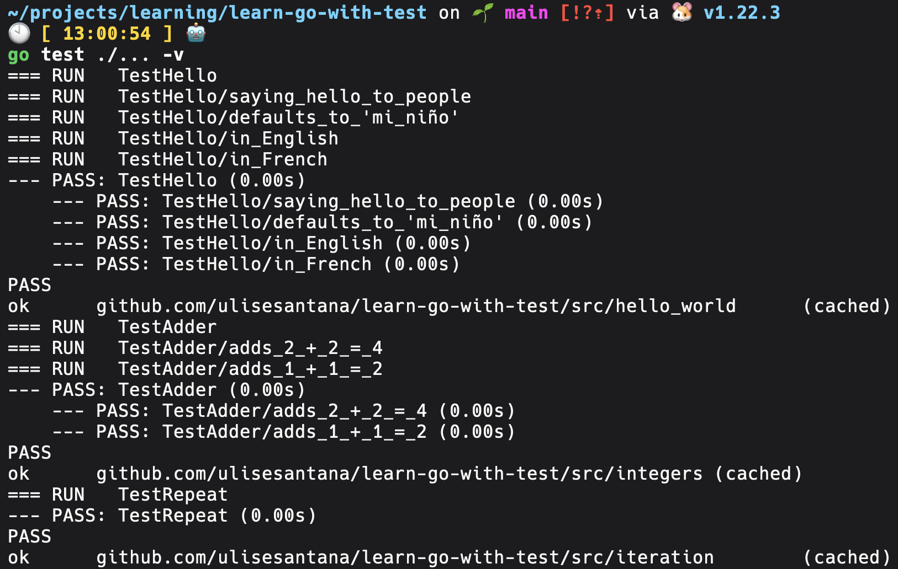
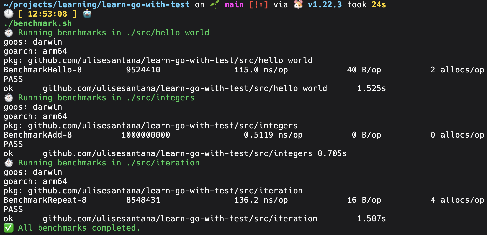
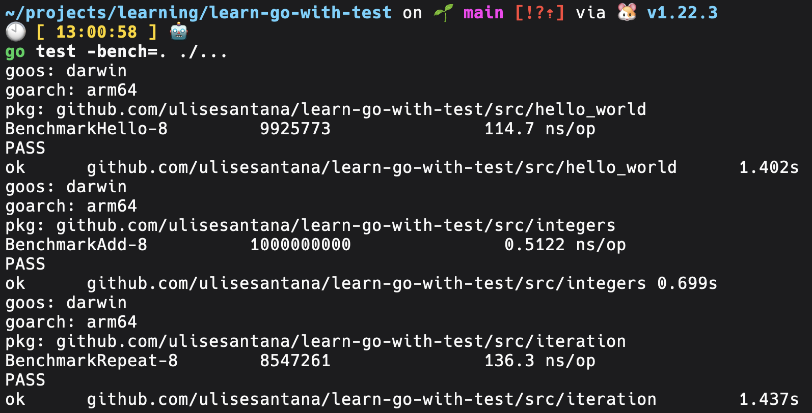

# Learn Go with tests
This repository is my journey of learning Golang by reading the book [Learn Go with tests](https://quii.gitbook.io/learn-go-with-tests).

## Scripts
### Run all test
#### Custom script
```shell
./test.sh # Run all test
```

```shell
./test.sh -w # Run all test and keep watching changes
```


#### Native way
```shell
go test ./... -v # Run all test in project
```


### Run all benchmarks
#### Custom script
```shell
./benchmark.sh # Run all benchmarks in project
```


#### Native way
```shell
go test -bench=. ./...  # Run all benchmarks in project
```

